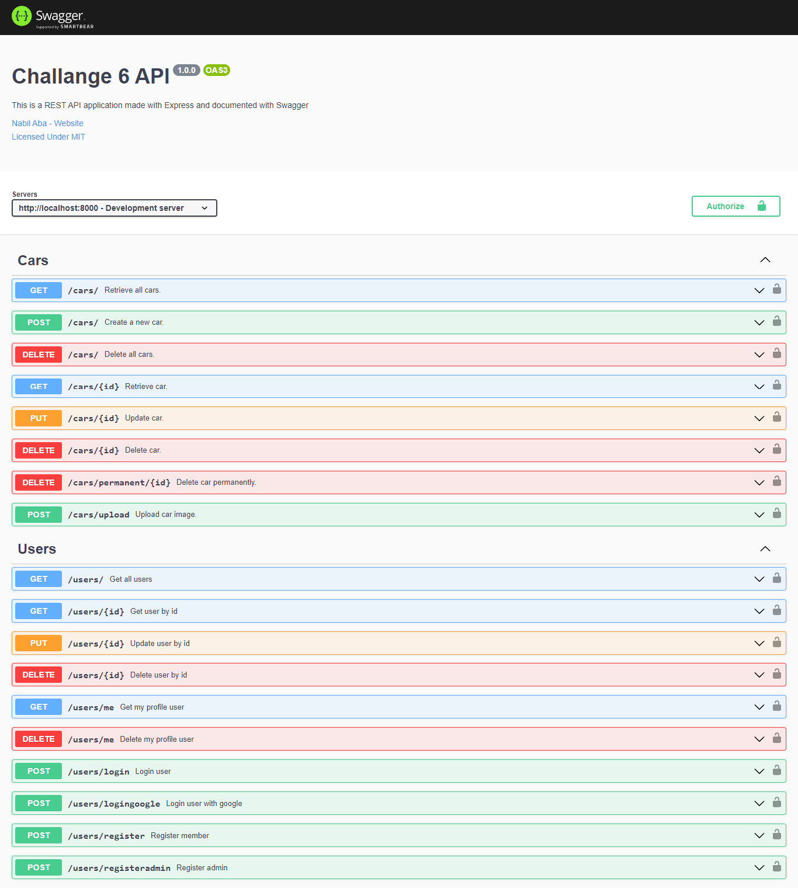

# Role Akses
- superadmin
  - email: superadmin@gmail.com
  - password: 12345678
- admin
  - email: admin@gmail.com
  - password: 12345678
- member
  - email: member@gmail.com
  - password: 12345678

# Tutorial Clone

- Buka file `config/config.json` dan ubah pengaturan `development` sesuai dengan pengaturan PostgreSQL Anda.

```javascript
{
  "development": {
    "username": "postgres",
    "password": "nabilaba",
    "database": "ch6_development",
    "host": "localhost",
    "dialect": "postgres"
  },
  "test": {
    "username": "postgres",
    "password": "nabilaba",
    "database": "ch6_test",
    "host": "localhost",
    "dialect": "postgres"
  },
  "production": {
    "username": "postgres",
    "password": "nabilaba",
    "database": "ch6_production",
    "host": "localhost",
    "dialect": "postgres"
  }
}
```

- Jalankan perintah `sequelize db:create` untuk membuat database.
- Konfigrusasi paket yarn dengan perintah `yarn install`.
- Jalankan perintah `yarn start` untuk menjalankan aplikasi.

# Quick Brief

1. Menggunakan express dan sequelize, untuk memenuhi kebutuhan CRUD.
2. Menggunakan bcrypt atau bcryptjs untuk mengenkripsi password user.
3. Menggunakan passport atau jsonwebtoken, untuk memenuhi kebutuhan Token Based Authentication.
4. Menggunakan Swagger Editor, Stoplight Studio, atau tools lain dalam menulis Open API Documentation.
5. Menggunakan Swagger, Redoc, Stoplight Element, atau Tools yang memvisualisasikan Open API documentation lainnya.
6. Menggunakan seeders untuk menginsert data superadmin.

# Endpoint

- Check at [http://localhost:8000/docs](http://localhost:8000/docs)
  
